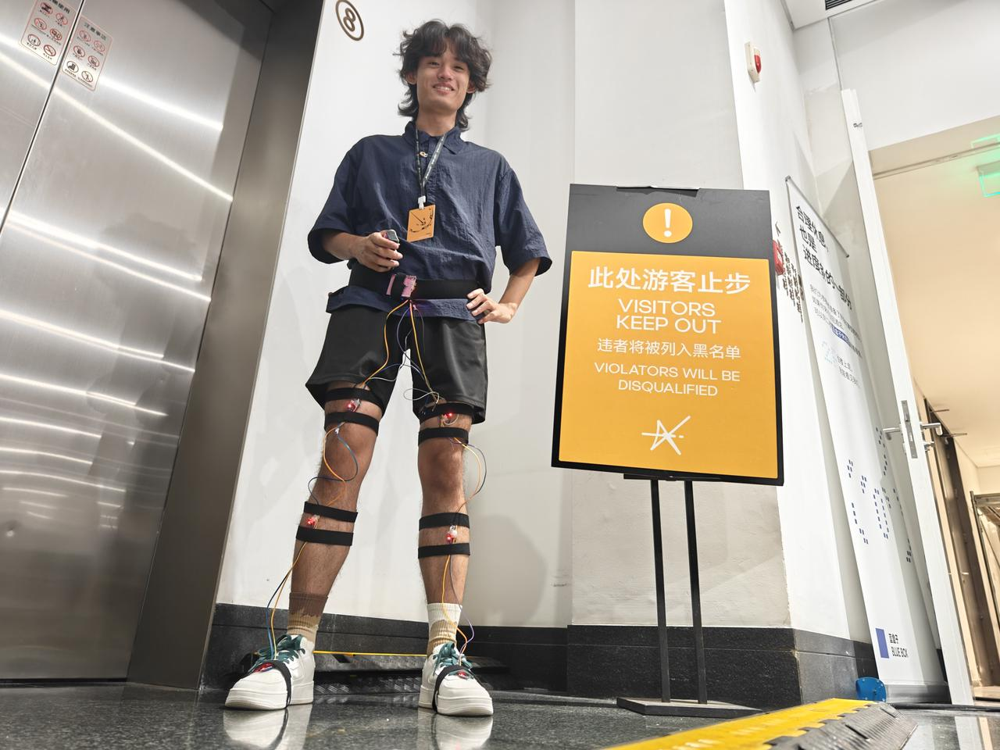

# ElectroFly作品说明文档

## 1. 作品名称
**ElectroFly飞电：跑者的肌肉电刺激系统**
## 2. 作品简述
ElectroFly 是一套**融合肌肉电刺激（EMS）、IMU运动学解算和AR引导**的跑步姿态闭环训练系统，旨在超越人类的有意识刻意练习，通过肌肉电刺激与视觉提示改善跑者运动模式，并加速高效肌肉记忆的形成。我们相信，人类的精进永无止境！
## 3. 作品详细描述
ElectroFly 打破了传统以“语言指导 + 有意识练习”为核心的人体动作训练范式，提出一种**基于电刺激的肌肉记忆学习路径**的新型运动技能学习方法。该系统不再依赖用户的理解能力或主观意愿参与，而是直接通过设备干预肌肉控制系统，实现动作的引导，并直接加速跑者正确肌肉记忆的形成。此外，ElectroFly够将高阶跑者的经验进行采集与量化，直接高阶跑者的肌肉记忆“迁移”到普大众跑者身上。进一步的，本项目在健身健美、未来的空间计算输入-输出交互；保健与康复等场景中都有广泛的应用可能。
在具体实现中，ElectroFly 由三大核心模块构成：
**1. 电刺激模块（EMS）**
- 安装于大腿、臀部等关键肌群位置的电刺激贴片，可根据下述系统生成的节奏或运动反馈触发低频电流，主动诱发肌肉收缩，从而帮助跑者建立正确的发力模式。
**2. IMU 姿态采集系统**
- 在腰部、膝部、脚踝等关键运动节点安装多组 IMU（惯性测量单元），可持续捕捉三轴加速度与角速度信号，计算跑步姿态（如骨盆角度、着地方式、步幅、步频等）。这些数据用于判断动作偏差、生成跑步周期模型，并辅助电刺激的实时干预逻辑。
**3. AR 眼镜与节奏反馈界面**
- AR 眼镜不仅可提供视觉提示与节奏引导（如节奏灯光、矫正动作图示），还可实时询问用户状态（如“How do you feel?”）并反馈关键信息，例如当前跑姿评分、是否出现骨盆下沉、步态不均衡等。未来版本将探索加入语音交互或眼动控制。
ElectroFly 的目标不是取代传统训练者，而是**降低运动技能学习门槛，实现“低理解度、高执行性”的动作形成路径**。该方法具有高度普适性和推广潜力，适用于以下多个场景：
- 日常健身人群：辅助普通人掌握更科学的跑步姿势，避免运动损伤，
- 运动康复阶段：在术后或康复早期，通过系统化干预帮助患者重建正确的运动模式；
- 专业运动员训练：作为高强度训练之外的动作复习与控制辅助工具。
- XR与空间计算：作为虚实双向交互（刺激+传感）的终端硬件设备
最终，ElectroFly 旨在建立一个“从设备直接到身体”的神经肌肉教学通路，探索未来无语言指导、可规模部署的动作训练新范式。
## 4. 项目利用的技术
ElectroFly 融合了多项前沿的可穿戴技术、传感器系统与智能算法，构建出一个多模态反馈驱动的运动学习系统。其主要技术包括：
---
**电刺激技术（EMS）**

- **功能：**通过电极贴片对腿部肌群施加低频电流，诱发肌肉收缩，辅助或提醒用户完成正确动作路径。
- **优势：**跳过传统语言与意识训练路径，直接在“神经-肌肉”通路上进行干预，形成肌肉记忆。
---
**6 IMU 惯性测量单元系统**

- **选型：**MPU6050
- **功能：**实时采集三轴加速度和角速度数据，用于分析运动过程中的姿态变化（如关节角度、步态周期、动作稳定性等）。
- **部署位置：**安装在大腿、小腿、脚背部位，以捕捉下肢运动信息。
- **作用：**可支持运动姿态识别、动作偏差检测，并为其他系统（如 EMS 或仿真建模）提供实时数据输入。

---
**URDF（统一机器人描述格式）**
- **功能：**通过参数化生成人体骨架模型，描述人体各部位的连接关系和运动学特性。
- **应用场景：**用于物理仿真和三维建模，支持姿态计算和动作可视化。
- **优势：**灵活适配不同身高和体型，便于个性化建模。

---
**数据处理与坐标系对齐**
- **功能：**通过旋转矩阵将 IMU 原始数据转换到统一的世界坐标系中，确保数据一致性。
- **应用场景：**用于姿态计算、动作分析以及与仿真环境的对接。
- **优势：**提高数据处理的准确性，确保多传感器数据的融合效果。

---
**PyBullet 物理仿真**

- **功能：**基于 IMU 数据和 URDF 模型，实时模拟人体运动并进行三维可视化。
- **应用场景：**用于动作分析、训练反馈和运动路径优化。
- **优势：**提供高精度的物理仿真环境，支持复杂的运动学和动力学计算。

---
**AR 增强现实眼镜**

- **型号：**Even Realities G1
- **功能：**作为运动过程中的信息交互界面，实时展示节奏引导、姿态偏差警告、用户状态问询等视觉信息。
- **设计理念：**提高用户在训练过程中的感知反馈，强化感知-运动闭环。

---
**AI 模型与动作识别算法（下一步展望）**
- **功能：**基于高阶跑者数据训练识别模型，识别用户跑姿偏差并生成个性化反馈策略。
- **特征：**
  - 动作分类与模板匹配
  - 跑步质量评分与异常检测
  - 与电刺激控制逻辑联动

---
**可视化交互平台（网页端）**
- **功能：**用户训练后可查看姿态报告、训练数据、反馈建议等；开发者用于调试与模型优化。
- **延展：**支持个性化分析、训练轨迹回放、训练过程评分等功能。
## 5. 主题
- Just Do It 脑洞
